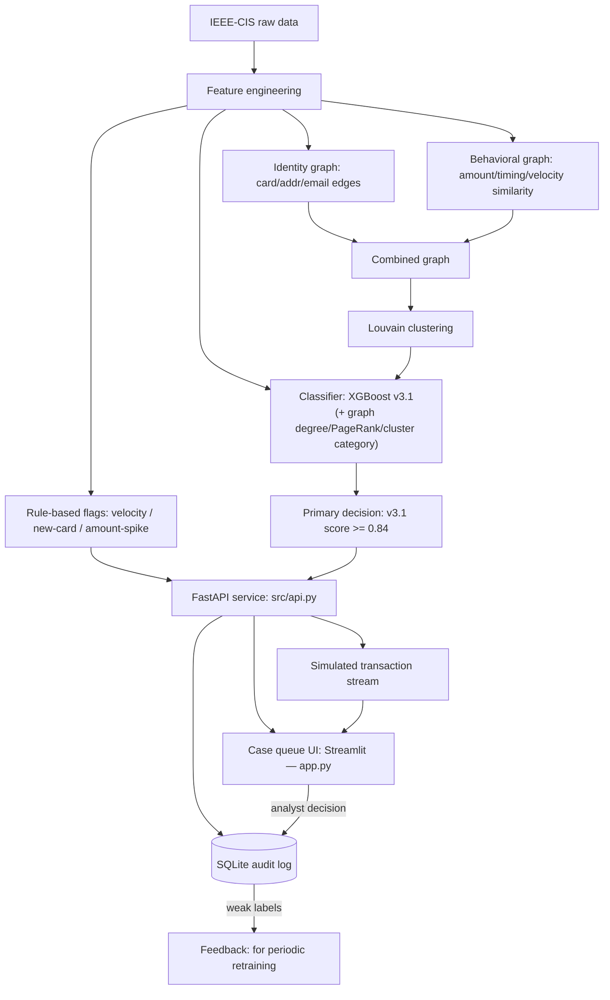

# AI Risk Manager

Hybrid fraud detection system for the Razorpay AI Buildathon (Track 02) — a transaction-level classifier combined with identity and behavioral ring detection, wrapped in a case-queue tool for an analyst to review and act on.

**Full explanation of the problem, approach, and results:** see [docs/](docs/) — start with [docs/problem-and-approach.md](docs/problem-and-approach.md).

## Status

In progress, building toward Sept 4, 2026 submission. The classifier, both graphs, the hybrid merge, the rule layer, the API, and the case-queue UI are all done — see [docs/README.md](docs/README.md) for the current per-component status.

## Architecture



Full reasoning behind every box: [docs/problem-and-approach.md](docs/problem-and-approach.md) for the why, [docs/case-queue-and-api.md](docs/case-queue-and-api.md) for the API/UI/audit-log layer specifically.

## Running it

Two processes, in separate terminals, after [Setup](#setup) below:

```
.venv/Scripts/uvicorn src.api:app --reload          # backend, http://localhost:8000 (docs at /docs)
.venv/Scripts/streamlit run app.py                  # frontend, http://localhost:8501
```

Open `http://localhost:8501`: pull a sample of transactions, adjust the sensitivity dial, and resolve cases (Approve/Hold/Decline/Escalate) — each decision is recorded in `data/processed/audit_log.db` and shown in the Review History tab. The stream is simulated (replays held-out data), stated honestly rather than implied to be live — see [docs/problem-and-approach.md](docs/problem-and-approach.md).

**Note:** the API needs `models/classifier_v3_1.joblib` and the graph artifacts under `data/processed/` to exist first — these are gitignored (not committed) and are produced by running `notebooks/03` through `notebooks/08e` in order, or by re-running just `notebooks/08e_v3_1_structural_features.ipynb` if the earlier processed artifacts are already present.

## Repo structure

```
data/raw/          Raw IEEE-CIS CSVs (not committed — see Setup)
data/processed/    Cached/derived data + the audit log DB (not committed)
models/            Fitted classifier + serving artifacts (not committed)
notebooks/         Analysis and model notebooks
src/               Shared, reusable, tested code (data, features, model, graphs, hybrid,
                    rules, serving, case reasons, audit log, the FastAPI app)
tests/             Tests for everything in src/
app.py             Streamlit case-queue UI (thin client of src/api.py)
results/           Saved metrics from each stage, for tracking progress over time
docs/              Concept-based product documentation
Dockerfile, requirements-api.txt, .dockerignore    Backend container (built, validated locally, not yet deployed)
```

## Setup

1. **Python**: this project pins Python 3.11.15 via [mise](https://mise.jdx.dev/) (`.mise.toml`).
2. **Create the virtual environment and install dependencies** (isolated to this project — nothing installed globally):
   ```
   python -m venv .venv
   .venv/Scripts/pip install -r requirements.txt
   ```
   `torch`/`torch-geometric` (used only for the one-off GNN experiment in `notebooks/08c_gnn_experiment.ipynb`) will pull a large CUDA build by default on some platforms. If you don't have a GPU, install the CPU-only build first to save time/disk space, then run the rest of `requirements.txt`:
   ```
   .venv/Scripts/pip install torch --index-url https://download.pytorch.org/whl/cpu
   .venv/Scripts/pip install -r requirements.txt
   ```
3. **Get the dataset**: download [IEEE-CIS Fraud Detection](https://www.kaggle.com/c/ieee-fraud-detection/data) from Kaggle (accept the competition rules, then "Download All") and unzip the CSVs into `data/raw/`.
4. **Run the tests** to verify the code works before touching notebooks:
   ```
   .venv/Scripts/python -m pytest
   ```
5. **Run a notebook**: open `notebooks/` in Jupyter or VS Code using the `.venv` kernel. Running `03` through `08e` in order builds every artifact the API needs (`models/classifier_v3_1.joblib`, the graph pickles, the cluster partition).
6. **Run the full product**: see [Running it](#running-it) above.

## Testing

Code in `src/` (data loading, feature engineering, and more as it's added) has unit tests in `tests/`, run with `pytest`. Notebooks stay for analysis and reporting; anything reused across notebooks is expected to live in `src/` with a test alongside it.
